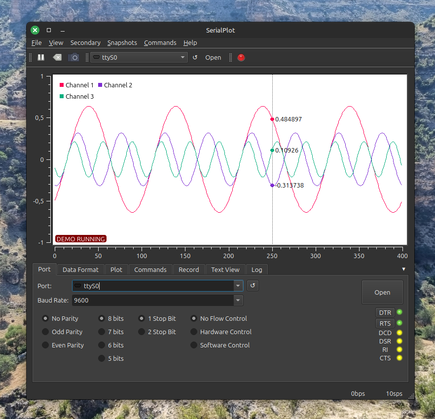

# SerialPlot

Small and simple software for plotting data from serial port in realtime.



## Features

* Reading data from serial port
* Binary data formats (u)int8, (u)int16, (u)int32, float
* User defined frame format for robust operation
* ASCII input (Comma Separated Values)
* Synchronized multi channel plotting
* Define and send commands to the device in ASCII or binary format
* Take snapshots of the current waveform and save to CSV file

See
[hackaday.io](https://hackaday.io/project/5334-serialplot-realtime-plotting-software)
page for [screenshots](https://hackaday.io/project/5334/gallery).

## Installation

Check the releases page.

## Dependencies

- Qt 6, including SerialPort module
- Qwt 6.3

## Building

### Obtain Dependencies

- Qt6 development packages
- Qt SerialPort module
- CMake
- git

Under Ubuntu/Debian:
```apt install qt6-base-dev qt6-serialport-dev qt6-svg-dev git cmake build-essential```

### Download and Install Qwt [You can skip this step]

[Qwt](http://qwt.sourceforge.net) is the library that provides
plotting widgets for SerialPlot. You have 3 different options for Qwt.

* Leave it to serialplot build scripts. Qwt will be downloaded and built for you.

* Download Qwt 6 [here](http://sourceforge.net/projects/qwt/files/)
  and build it yourself per these
  [instructions](http://qwt.sourceforge.net/qwtinstall.html#qwtinstall-unix)
  and install. Make sure you use Qt6 to build. When calling cmake for
  serialplot, `BUILD_QWT` cmake option to `false`. If you didn't
  install qwt after building point `QWT_ROOT` variable to `qwt/`
  directory that you have just built.

### Download and Build SerialPlot

You can use git to download SerialPlot source code. 

    git clone https://github.com/hyOzd/serialplot
    cd serialplot
    mkdir build && cd build
    cmake ..
    make -j

## License

This software is licensed under GPLv3 excluding some third party
files. See file COPYING for details.
